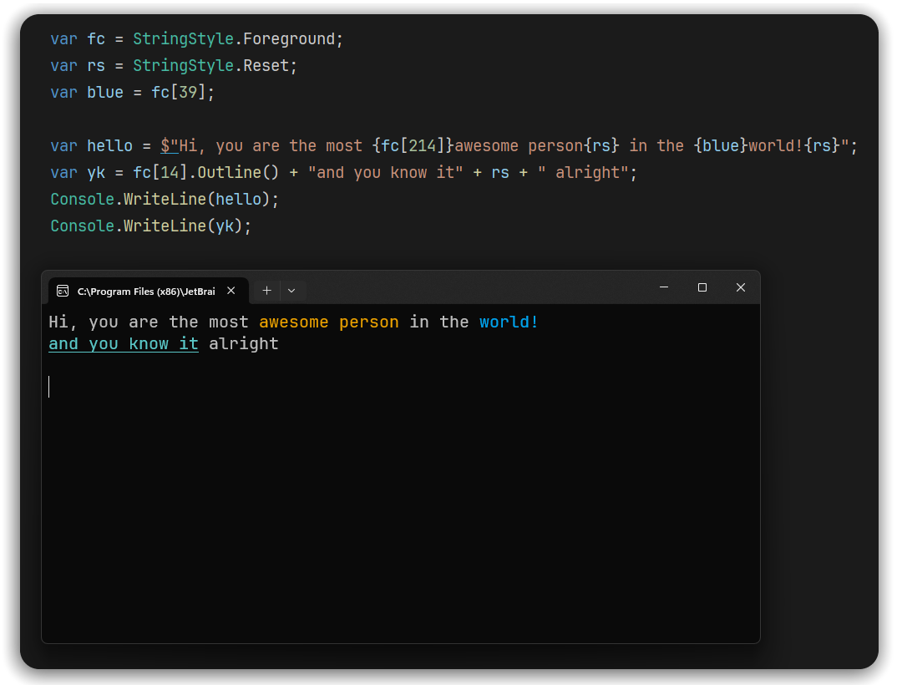

<div align="center">
    <br>
    
</div>

<h2 align="center">AnsiStyles</h2>
<h4 align="center">This lightweight, simple library provides a easy and intuitive way for adding color to your console applications, allowing you to add multiple different colors and styles to the same string variable.</h4>
<div align="center">
  
  <a href=""></a>
  <a href=""></a>
  
</div>

<br>
<br>
<div align="center">
    
</div>

Usage
----

```csharp
var rs = StringStyle.Reset;
var fc = StringStyle.Foreground;
var prpl = fc[129];

string text = $"This is {prpl}purple{rs} and this is {fc[196]}red{rs}";
Console.WriteLine(text); //Will print out 'text' with purple and red colored

//Can also use some ANSI code for styling 
var boBlue = fc[21].Bold().Outline();
Console.WriteLine(fc[70].Faint() + "some text" + $"{boBlue} bold outlined blue{rs}");

//You can also concat it with regular strings
var text2 = fc.Yellow + "This is yellow " + rs + prpl + "and this is purple";
Console.WriteLine(text2);
Console.WriteLine("Look, i'm still purple!");

Console.WriteLine(rs);                //Remember to always apply reset to the end of the strings
Console.WriteLine("i'm normal now!"); //Or you can just print the reset out, else the applied color/style
                                      //will keep bleading in subsequent prints until it finds a reset

//All of the above but for the background of the string
var bc = StringStyle.Background;
Console.WriteLine(bc.White + fc.Black + "Black text with White highlighting" + rs);
    
fc.ColorTest(); //prints out all the available colors codes
bc.ColorTest();
```

Installation
----

### NuGet

The latest stable version is available on [NuGet](https://www.nuget.org/)

```bash
dotnet add package AnsiStyles
```

### From source

Alternatively, you can easily build from source if needed

```shell
git clone https://github.com/Haise777/AnsiStyles
cd AnsiStyles/AnsiStyles
dotnet build --configuration Release

# Here you can find the compiled assembly file 'AnsiStyles'
cd bin/Release/net6.0 
```
You can add the compiled assembly to your projects by adding a reference to the assembly file, you can follow [this entry in a Microsoft article](https://learn.microsoft.com/en-us/dotnet/core/tools/dotnet-add-reference#add-a-reference-to-an-assembly-that-isnt-in-a-project) for more information.

Contributing
----
### Feel free to contribute  
- Just fork and clone the repository
- Then commit and pull request only for the `dev` branch. 

Support
----
- If you encouter a bug or would like to request a feature, [please submit an issue](https://github.com/Haise777/AnsiStyles/issues/new).  
- For any other question that is not related to bugs or feature, feel free to contact me.

---
*AnsiStyles is released under [BSD 3-Clause license](https://opensource.org/license/bsd-3-clause/)*

> *Contact me*\
> *Email:* [gashimabucoro@proton.me](mailto:gashimabucoro@proton.me) &nbsp;&middot;&nbsp;
> *Discord:* [@.haise_san](https://discord.com/users/374337303897702401)

