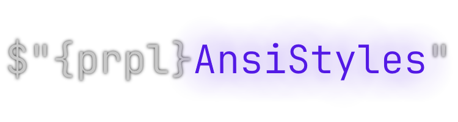

<h1 align="center">
  <br>
  
  <br>
</h1>
<h2 align="center">AnsiStyles</h2>
<p align="center">[shields] [shields] [shields] [shields]</p>
<p align="center">Random app description the quick brown fox jumped over the lazy dog blablablalbalblal too much text omg that is a nice a description bro oh yes irredemable rando words.</p>

<p align="center">[image]</p>

Usage
----
```csharp
Console.WriteLine("Oi");
var thing = Nothing.nothingness;

if (true != false)
{
    Console.WriteLine($"{thing} hello friends"); 
}
```

Installation
----
### NuGet
You can find it on nuget, yeah idwaoj oidawj podawi opdjwaop jdawop jdwapoij dpoawj dopwaj dwoa jpdawj opawjdpoawjpo
```bash
dotnet install dwakodwa
```
### From source
Alternatively, you can easily build from source fol
```shell
git clone https://github.com/Haise777/AnsiStyles
cd AnsiStyles/AnsiStyles
dotnet build --release
```

Contributing
----
djawdwioadwa  
dwadwa

Support
----
If you need help you need help

---
AnsiStyles is released under [BSD 3-Clause license](https://opensource.org/license/bsd-3-clause/)

> Contact me\
> Email: [gashimabucoro@proton.me](mailto:gashimabucoro@proton.me) &nbsp;&middot;&nbsp;
> Discord: [@.haise_san](https://discord.com/users/374337303897702401)

